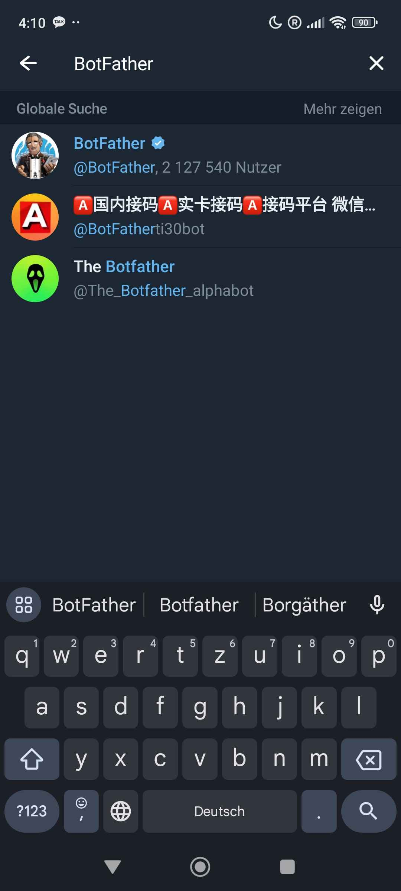
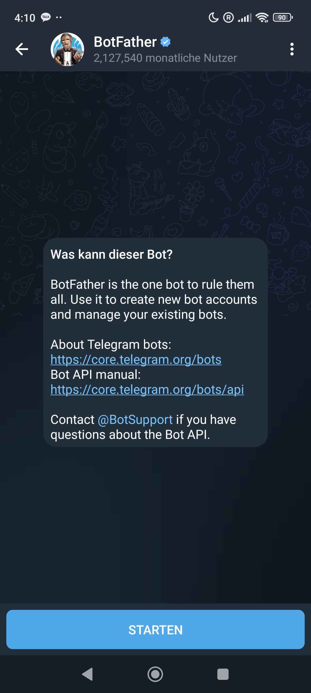

# Creation of BotFather

# Creation of BotFather

1. Add the BotFather. 

2. Star a conversation. Press the Start Button.

3. Write in chat /newbot. After sending it you will be prompted to enter
a username.

4. Now add The comands 
   1.  type /setcommands.
   2.  type @botname where botname is the name of the bot you created
   3.  post the comand creation comand provided in the botCOMANDcreation.txt

   
