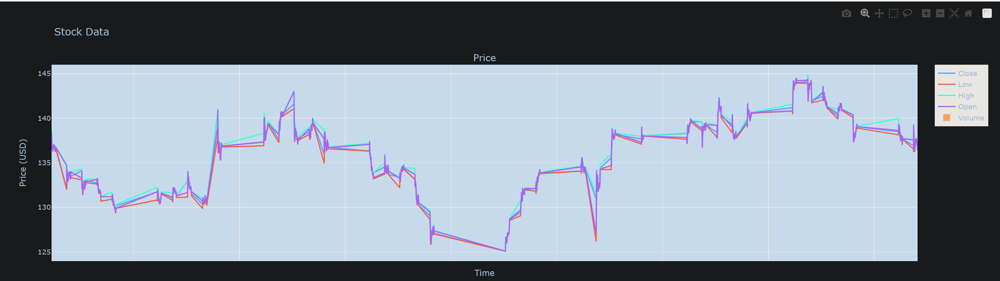

  <a href="https://github.com/mannmi/StockPriceVisualizer/issues?q=is%3Aopen+is%3Aissue+-label%3A%22Application+Proposal%22+-label%3A%22WIP%22+">🚀 Apply for Open Task</a> | <a href="https://github.com/mannmi/StockPriceVisualizer/issues">✍️ Submit Your Idea</a> | <a href="https://github.com/mannmi/StockPriceVisualizer/issues/new?assignees=&labels=&projects=&template=bug_report.md&title="> 🐛 Submit Bug Report</a>

  <!-- PSE Acceleration Program logo -->
  

  

---

# Stock Price Visualizer

StockPriceVisualizer: 📈 Dive into the world of stock prices with real-time visualizations and insights. Perfect for
traders, investors, and finance enthusiasts!

## "Features"

- Server (data scraper)
- Server (API) for fetching data and updating said data
- UI/API usage

--- 

##  UI Setup Script tested for Ubunut 24.04 LTS (Fresh Install) Only 

---

## Installation

For a guide on how to install the application, refer to [docs/INSTAL.md](INSTAL.md)

## Starting Server (API)/DB/UI

For a guide on how to run the application, refer to [docs/RUN.md](RUN.md)

## User Guide

For a guide on the button functionality, please read the [User Guide](USING_APP.md)

---

### API Documentation

For a short explanation of the Django API created, refer to API Documentation.

API Documentation => [API Documentation LINK](API_DOCUMENTATION.md)

Or run the web server (use the IP of the server):

- http://127.0.0.1:8000/api/rawDocumentation/
- http://127.0.0.1:8000/documentation/

---

## Contributing

Contributions are welcome! Please see the CONTRIBUTING.md, COMMIT_MESSAGE.md, and CODE_OF_CONDUCT.md for guidelines.

* [CONTRIBUTING.md](CONTRIBUTING.md)
* [COMMIT_MESSAGE.md](COMMIT_MESSAGE.md)
* [CODE_OF_CONDUCT.md](CODE_OF_CONDUCT.md)

## TODO List

- [x] Fix database scraper (there still seems to be an issue with the function `fetch_active_period`). For now, it is
  commented out, but fixing it would improve performance when updating the database. The improvement only works on second fetch :) 
- [x] Switch the graph rendering for the table; it's kind of bad. (Qt web seems to be broken on my system, so I can't
  test it. It now opens a browser tab instead.). Fixed all credits go to => [link](https://stackoverflow.com/questions/39184615/qwebengineview-cannot-load-large-svg-html-using-sethtml)
- [ ] Fix filter rules
- [ ] There is currently no protection against race conditions (The watch list load has to be manually triggered).
- [ ] TODO Split the Requirements.txt into separate files (This will make the installation of the ui Simpler as it does
  not need mysql handeler)
- [x] TODO fix the Historical Data storage, Bug with storing older Data. Data only store for the last x Month but more
  data is fetched. => Please do not check the Fix
- [x] Add Doxygen Documentation. (Add issue if you find missing/faulty docstring)

## Work on in Future patch
- [ ] add Multi threading 

--- 

## License

This project is licensed under the AGPL3 License. See the LICENSE file for details.

License => [https://github.com/mannmi/StockPriceVisualizer?tab=LGPL-2.1-1-ov-file](https://github.com/mannmi/StockPriceVisualizer/blob/main/LICENSE)

---

## Contributor List

- mannmi
