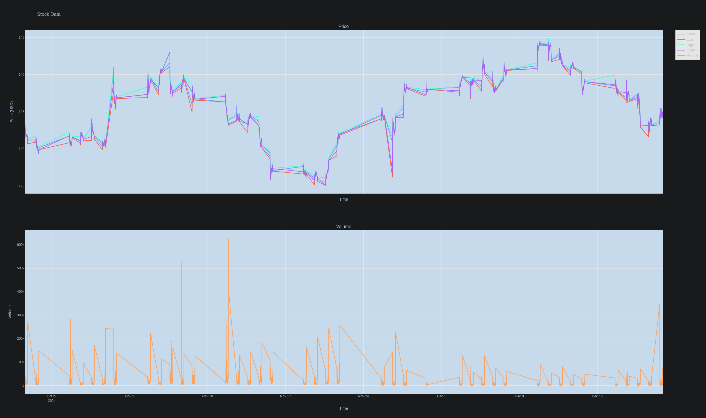

# User Guide

## Getting Started

Clone the Latest Version of the Project: bash git clone <repository_url>   
Follow the Installation Guide and Run Guide.

## Menu (Buttons and Their Functions)

## Important Notice

Check the server output! Just because the UI is frozen does not mean it's not working.

The UI may become unresponsive when rendering certain views.  
This issue is known and will be addressed in future updates.

The UI is asynchronous, meaning that button events may only complete  
once they are processed on the server, such as updating the watch list.

## Button and Element Functions

### Filter (Currently not functional) !\ui_FILTER\

### Watch List

* Get Watch List: Fetches the trackers that are set to "watching".  
* Update Watch List: Updates the entire watch list with new trade data.  
  * (Note: Visualization is possible only if this is run.)
  * Don't forget to add stocks/tickers to the watch list.

### Ticker List Ticker List (related to the Ticker List database):

* Update Ticker List: Fetches a new Ticker List and updates the file.  
* Store Ticker List: Saves the Ticker List to the database (required to run).  

### Ticker File

* Get All Tickers File: Reads tickers from the text file.
* Get All Tickers from Last Fetch: Reads tickers from the last fetch (from the file).
* Get Tickers Stored in Database: Retrieves tickers stored in the database (recommended as it includes watch status).

### Add Ticker to Watch List 
A button will appear next to each ticker, giving you the option to select True or False.

* Selecting True will add the ticker to your watch list.
* Selecting False will remove the ticker from your watch list.

You can view the active watch list (stored in the database) by:  
    * A) Fetching from the database.  
    * B) Getting the watch list.

### Data Visualization Preparation:

1) Add tickers to the watch list.
2) Go to Watch List and select Get Watch List.
3) If not done yet, update the watch list.

### Visualization:

1) Press the Visualize button (wait a bit for the server to finish fetching).

2) See the graph (if your Qt web does not work, it will open in a browser).
